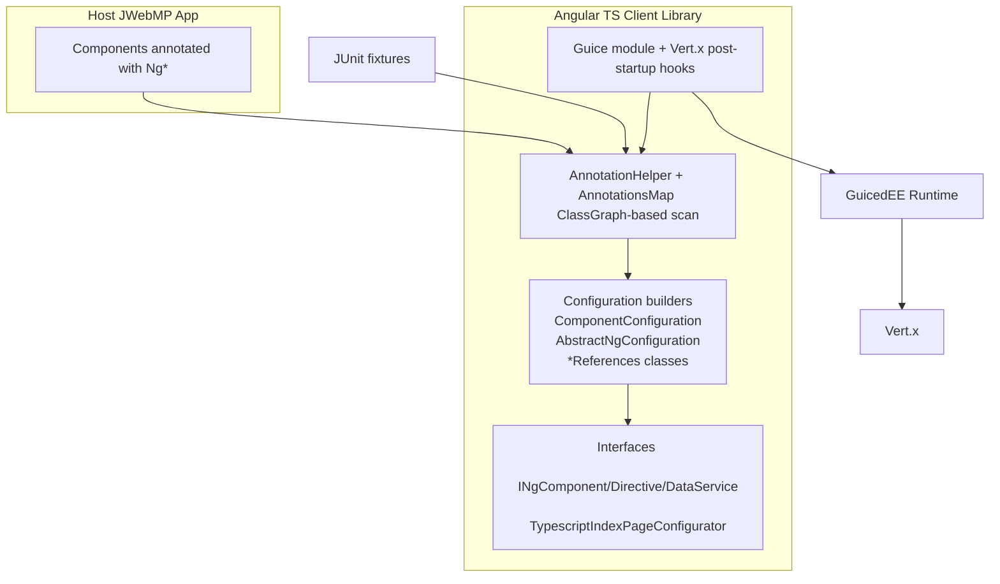

# C4 Level 2 — Containers

```mermaid
flowchart TB
    subgraph Host[Host JWebMP App]
        UI[Components annotated with Ng*]
    end

    subgraph Library[Angular TS Client Library]
        Scan[AnnotationHelper + AnnotationsMap ClassGraph-based scan]
        ConfigBuilders[Configuration builders 
        ComponentConfiguration
        AbstractNgConfiguration
        *References classes]
        Lifecycle[Guice module + Vert.x post-startup hooks]
        SPI[Interfaces 
        INgComponent/Directive/DataService
        TypescriptIndexPageConfigurator]
    end

    Guice[GuicedEE Runtime]
    Vertx[Vert.x]
    Tests[JUnit fixtures]

    UI --> Scan
    Scan --> ConfigBuilders
    ConfigBuilders --> SPI
    Lifecycle --> Scan
    Lifecycle --> Guice
    Guice --> Vertx
    Tests --> Scan
```

Containers observed in code only; CI/build containers are handled separately in GitHub Actions (see RULES/GUIDES for templates).
