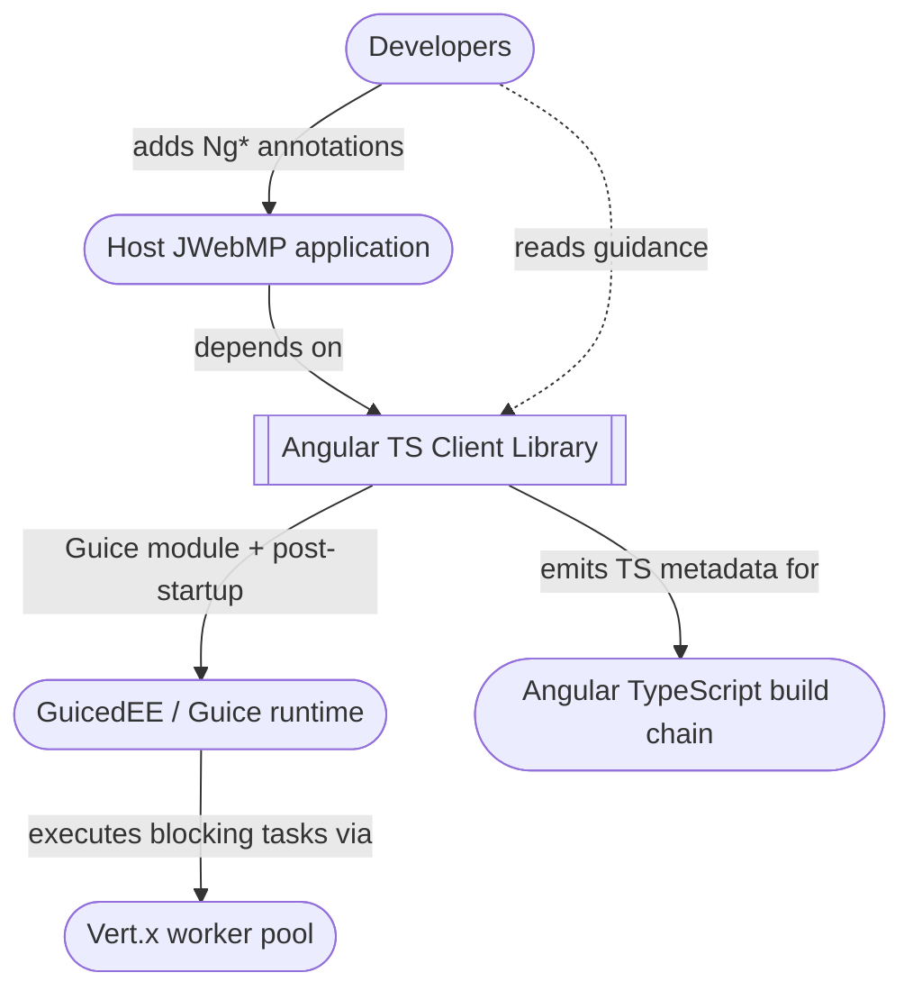

# C4 Level 1 — Context

```mermaid
flowchart TB
    Dev([Developers])
    HostApp([Host JWebMP application])
    Library[[Angular TS Client Library]]
    Guice([GuicedEE / Guice runtime])
    Vertx([Vert.x worker pool])
    TSConsumer([Angular TypeScript build chain])

    Dev -->|adds Ng* annotations| HostApp
    HostApp -->|depends on| Library
    Library -->|Guice module + post-startup| Guice
    Guice -->|executes blocking tasks via| Vertx
    Library -->|emits TS metadata for| TSConsumer
    Dev -.reads guidance .-> Library
```

Scope is limited to the library and its integration points; deployment and external services are managed by the host JWebMP app.
