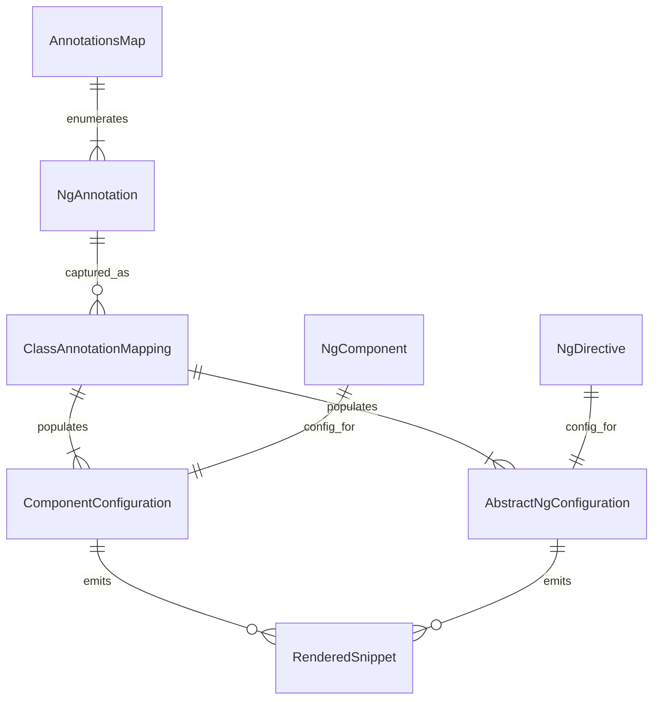

# ERD — Annotation to Configuration Flow

Entities are conceptual: NgAnnotation represents any Ng* annotation type, and RenderedSnippet represents the TypeScript strings produced by `render*()` methods.
