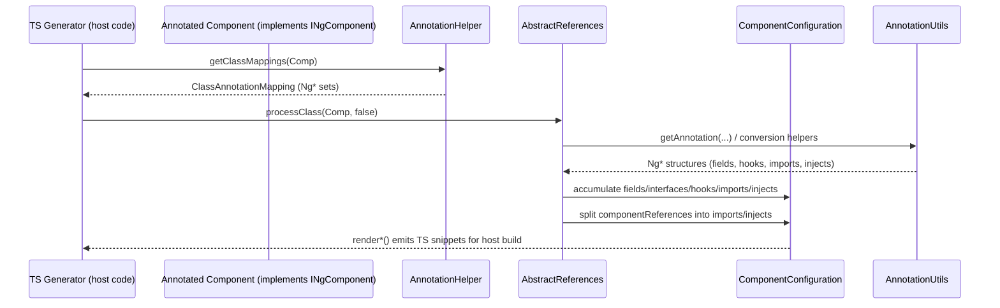

# Sequence — Building Component Configuration

```mermaid
sequenceDiagram
    participant Gen as TS Generator (host code)
    participant Comp as Annotated Component (implements INgComponent)
    participant Helper as AnnotationHelper
    participant Ref as AbstractReferences
    participant Config as ComponentConfiguration
    participant Utils as AnnotationUtils

    Gen->>Helper: getClassMappings(Comp)
    Helper-->>Gen: ClassAnnotationMapping (Ng* sets)
    Gen->>Ref: processClass(Comp, false)
    Ref->>Utils: getAnnotation(...) / conversion helpers
    Utils-->>Ref: Ng* structures (fields, hooks, imports, injects)
    Ref->>Config: accumulate fields/interfaces/hooks/imports/injects
    Ref->>Config: split componentReferences into imports/injects
    Config-->>Gen: render*() emits TS snippets for host build
```
