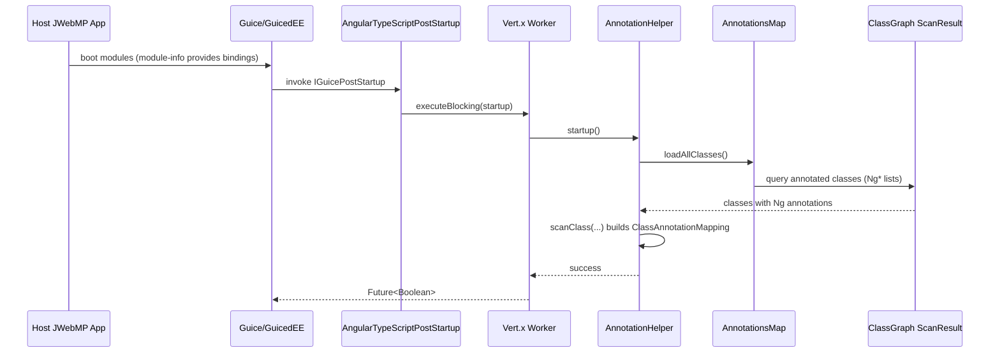

# Sequence — Startup Annotation Scan

```mermaid
sequenceDiagram
    participant Host as Host JWebMP App
    participant Guice as Guice/GuicedEE
    participant PostStartup as AngularTypeScriptPostStartup
    participant Vertx as Vert.x Worker
    participant Helper as AnnotationHelper
    participant Map as AnnotationsMap
    participant Scan as ClassGraph ScanResult

    Host->>Guice: boot modules (module-info provides bindings)
    Guice->>PostStartup: invoke IGuicePostStartup
    PostStartup->>Vertx: executeBlocking(startup)
    Vertx->>Helper: startup()
    Helper->>Map: loadAllClasses()
    Map->>Scan: query annotated classes (Ng* lists)
    Scan-->>Helper: classes with Ng annotations
    Helper->>Helper: scanClass(...) builds ClassAnnotationMapping
    Helper-->>Vertx: success
    Vertx-->>Guice: Future<Boolean>
```
